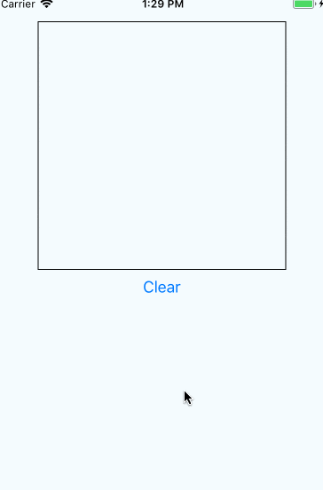

# ReactNative_MNIST
**IN ENGLISH:** JavaScript mobile number figure-outer

**ML:** React Native implementation of the MNIST data trained in a BrainJS MLP (non conv) predictive model.

### Notes:
Due to a DOM dependency this project uses patch-package to modify Brain.js.  This will automatically remove `stream` which is not polyfilled in React Native.   The benefit?  This project works out the box, no need to edit `node_modules`.

Additionally, there doesn't seem to be a way to get pixel data of images in React Native, so some native Objective C is included in this project.  If requested, I'll create an Android version + node module of the `getPixels` function to complete cross-platform capabilities.

### Thanks
Special thanks to [Robert Plummer](https://github.com/robertleeplummerjr) and [Ralph Schaer](https://github.com/ralscha)
who's source helped speed this project along.  Also, this would have been insanely difficult without the awesome node-module by 
[Terry](https://github.com/terrylinla), the [react-native-sketch-canvas](https://github.com/terrylinla/react-native-sketch-canvas).

Read more about MLP MNIST by Ralph [here](https://golb.hplar.ch/2019/01/machine-learning-with-brain-and-tensorflow-js.html).  
The MNIST dataset was created in 1999 by Lecun, read more [here](http://yann.lecun.com/exdb/mnist/)

As always, thanks to [Infinite Red](https://infinite.red/), for a supportive community while I work on adancing Machine Learning.
